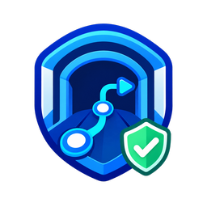
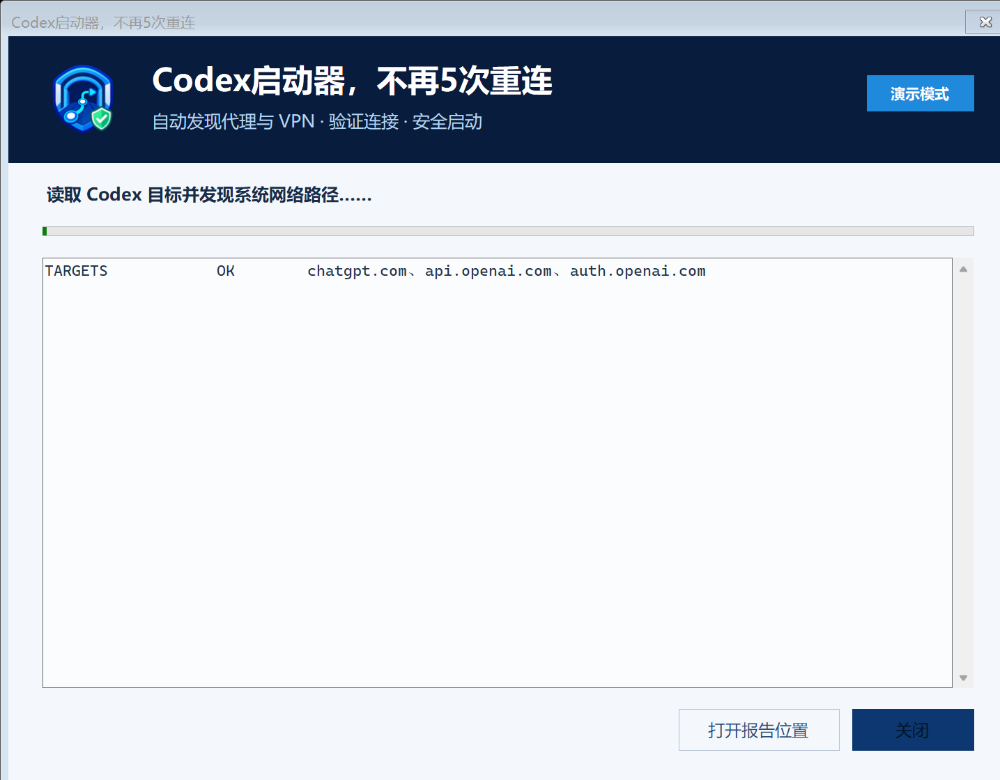
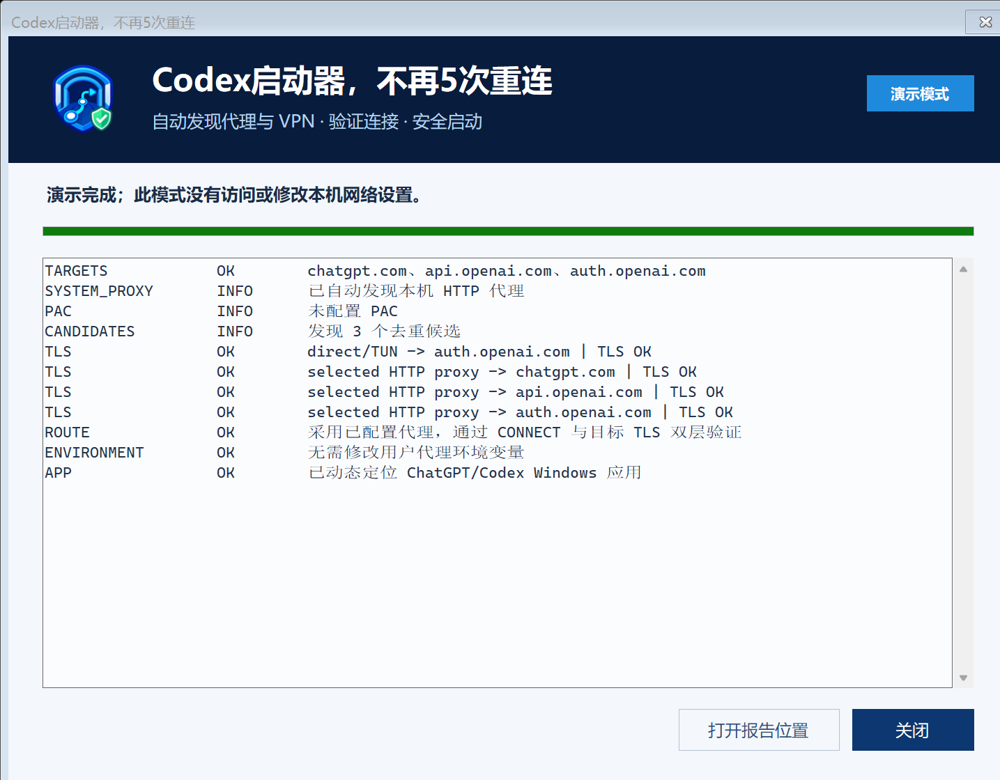

<div align="center">
  
  <h1>Codex启动器，不再5次重连</h1>
  <p><strong>Codex Launcher — No More 5× Reconnects</strong></p>
  <p>Discover the Windows network path that actually works, validate TLS, and then launch ChatGPT/Codex.</p>

  [简体中文](README.zh-CN.md) · [Download](https://github.com/linagent/codex-universal-launcher/releases/latest) · [Report a bug](https://github.com/linagent/codex-universal-launcher/issues/new?template=bug_report.yml)

  [](https://github.com/linagent/codex-universal-launcher/actions/workflows/build.yml)
  [](https://github.com/linagent/codex-universal-launcher/releases)
  [](LICENSE)
</div>

> [!IMPORTANT]
> This is an unofficial community project. It is not affiliated with, sponsored by, or endorsed by OpenAI. It can reduce startup failures caused by stale or uninherited proxy settings, but it cannot guarantee zero reconnects: account, service, provider, quota, and streaming-runtime failures are outside its control.

## Why this exists

Windows users often have more than one network signal at the same time: a system proxy, PAC, WinHTTP proxy, environment variables, a local HTTP/SOCKS listener, or a VPN/TUN adapter. A desktop app may inherit a stale value even while the browser works.

The launcher performs a bounded preflight before launch:

1. Reads only the target host names needed for the installed ChatGPT/Codex app and any custom `base_url` host in Codex configuration.
2. Discovers configured HTTP/SOCKS routes and active VPN/TUN signals without assuming a specific proxy product or port.
3. Tests direct/TUN and candidate proxy routes with a real TCP tunnel and TLS handshake.
4. If necessary, backs up and adjusts only the current user's proxy environment variables.
5. Locates the installed Windows app dynamically and launches it only after the preflight passes.

It does **not** install, configure, restart, or control your proxy/VPN software. It does not reset DNS, Winsock, routes, firewall rules, or Codex data.

## Screenshots

| Preflight | Validated route |
| --- | --- |
|  |  |

The screenshots use `--demo`; they contain representative data and do not expose a real proxy port, AppID, account, or local path.

## Quick start

1. Download the recommended lightweight ZIP from [Releases](https://github.com/linagent/codex-universal-launcher/releases): `lite-win-x64` for most Windows PCs, or `lite-win-arm64` for Windows on Arm.
2. Extract the ZIP to a normal folder. Optionally compare its SHA-256 value with the release notes.
3. Run `CodexUniversalLauncher.exe`. Keep your proxy/VPN running; after validation, the launcher automatically closes an existing ChatGPT/Codex instance and starts a fresh one.

The recommended `lite` download is about 170–180 KB and retains all launcher features. It requires the free [.NET 8 Desktop Runtime](https://dotnet.microsoft.com/download/dotnet/8.0). If Windows reports that .NET is missing, install the Desktop Runtime and run the launcher again, or use the larger `portable` download. The portable build embeds the runtime and needs no separate .NET installation.

| Package | Recommended for | Size profile | Requirement |
| --- | --- | --- | --- |
| `lite-win-x64` | Most Intel/AMD Windows PCs | About 180 KB | .NET 8 Desktop Runtime x64 |
| `lite-win-arm64` | Windows on Arm | About 170 KB | .NET 8 Desktop Runtime Arm64 |
| `portable-win-x64` | Intel/AMD PCs where installing a runtime is undesirable | About 63 MB | None |
| `portable-win-arm64` | Windows on Arm where installing a runtime is undesirable | About 59 MB | None |

Both variants are currently unsigned, so Windows SmartScreen may show an unknown-publisher warning. If that is not acceptable, build from source.

## Modes

```text
CodexUniversalLauncher.exe --check-only
CodexUniversalLauncher.exe --no-repair
CodexUniversalLauncher.exe --silent --result result.txt
CodexUniversalLauncher.exe --demo
CodexUniversalLauncher.exe --keep-existing
CodexUniversalLauncher.exe --self-test --result self-test.txt
```

| Option | Behavior |
| --- | --- |
| `--check-only` | Read-only diagnosis. Does not write environment variables and does not launch the app. |
| `--no-repair` | Tests the routes and launches the app, but only previews environment-variable changes. |
| `--silent` | Runs without a visible window and writes the requested result file. |
| `--result <path>` | Writes a small machine-readable result summary. |
| `--demo` | Displays sanitized representative results; does not inspect or modify the network. |
| `--keep-existing` | Keeps an already-running ChatGPT/Codex instance instead of automatically restarting it. The existing process may not inherit repaired proxy variables. |
| `--self-test` | Runs offline parser, redaction, and safety-boundary tests. |

For the safest first run, start with `--check-only`, inspect the local report, and then run normally.

## What it can discover

- Windows system proxy and PAC-resolved routes
- User, process, and machine `HTTP_PROXY`, `HTTPS_PROXY`, and `ALL_PROXY`
- WinHTTP proxy configuration
- Local listeners owned by common proxy/VPN engines, with the port discovered at runtime
- HTTP, HTTPS-proxy CONNECT, and SOCKS5 tunnels
- Direct, transparent VPN, and TUN paths
- Custom Codex provider host names from `base_url` in `config.toml`
- Installed ChatGPT/Codex Start menu AppID, without hard-coding a package identifier

Discovery is intentionally best-effort. Authenticated enterprise PAC scripts, products that expose no standard Windows signal, non-SOCKS/HTTP proprietary tunnels, or policies that block TLS probing may require manual configuration.

## Changes and rollback

Normal launch mode may change only these **per-user** variables when a tested route requires it:

- `HTTP_PROXY`
- `HTTPS_PROXY`
- `ALL_PROXY`
- `NO_PROXY`

Before writing, the launcher saves a JSON backup under `%LOCALAPPDATA%\CodexUniversalLauncher\backups`. It refuses to copy proxy URLs containing embedded credentials into a new environment configuration.

In normal launch mode, after all preflight checks pass, the launcher automatically closes running `ChatGPT` processes so the new ChatGPT/Codex instance inherits the selected environment. It deliberately does not target generic `Codex.exe` processes, avoiding Codex CLI and unrelated tools. It first requests a normal close and waits up to eight seconds; remaining ChatGPT background processes are then terminated automatically. This can interrupt unfinished generations or tool calls, so finish important work before running the launcher. Use `--keep-existing` to opt out. Read-only, demo, and self-test modes never close the app.

No registry proxy settings, VPN settings, DNS, Winsock, firewall rules, credentials, cookies, conversations, or project files are modified.

## Privacy

- No telemetry, analytics, advertising, or remote log upload.
- Reports and rotating logs stay under `%LOCALAPPDATA%\CodexUniversalLauncher`.
- Reports contain route diagnostics and local listener metadata, so review them before sharing.
- Secret-like values, URL credentials, bearer tokens, and API-key patterns are redacted.
- Codex configuration is inspected only for `base_url` host names; API keys and conversation content are not read.

See [SECURITY.md](SECURITY.md) for reporting vulnerabilities and the trust boundary.

## Build from source

Requirements: Windows 10/11 and the .NET 8 SDK.

```powershell
dotnet restore
dotnet build -c Release
dotnet run -c Release -- --self-test --result self-test.txt
dotnet publish -c Release -r win-x64 --self-contained false -p:PublishSingleFile=true -p:DebugType=None -p:DebugSymbols=false
dotnet publish -c Release -r win-x64 --self-contained true -p:PublishSingleFile=true -p:IncludeNativeLibrariesForSelfExtract=true -p:EnableCompressionInSingleFile=true -p:DebugType=None -p:DebugSymbols=false
```

The project has no third-party NuGet dependencies. CI builds and runs the offline self-tests on Windows.

## Project status

Version 2.0.1 adopts the Chinese project name “Codex启动器，不再5次重连”, adds automatic restart of an already-running ChatGPT/Codex instance after a successful preflight, and introduces a lightweight single-file download alongside the dependency-free portable fallback. See [ROADMAP.md](ROADMAP.md) for planned work and [CHANGELOG.md](CHANGELOG.md) for shipped changes.

Contributions are welcome. Please read [CONTRIBUTING.md](CONTRIBUTING.md) before opening a pull request. Small compatibility reports for a specific proxy/VPN product are particularly useful, provided secrets and real account data are removed.

## Trademark notice

“OpenAI”, “ChatGPT”, and “Codex” are trademarks of their respective owner. This project's original icon is used only to identify this independent compatibility utility and does not reproduce the OpenAI logo. For official Codex information, use the [official OpenAI developer documentation](https://developers.openai.com/).

## License

[MIT](LICENSE) © 2026 linagent
